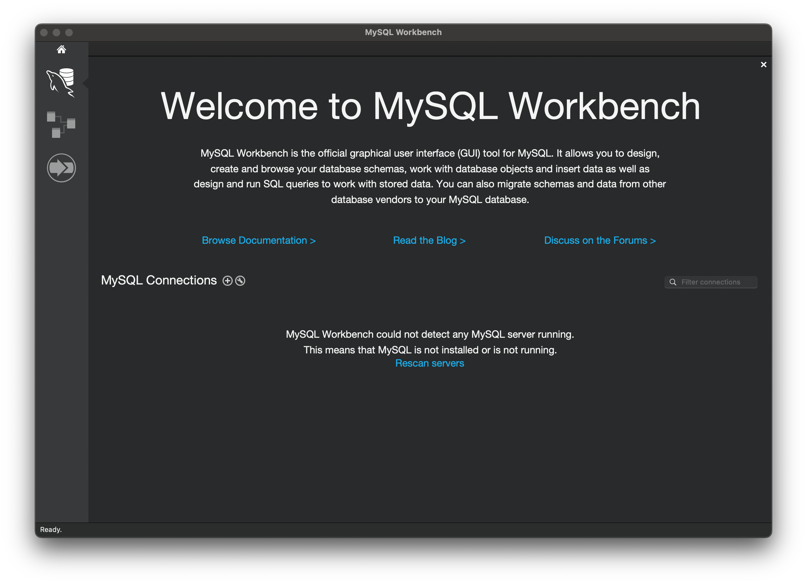
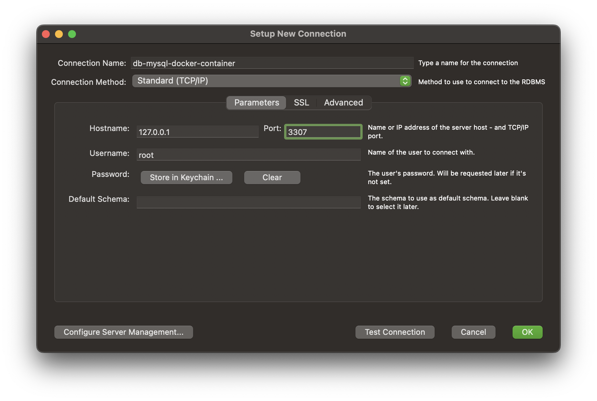
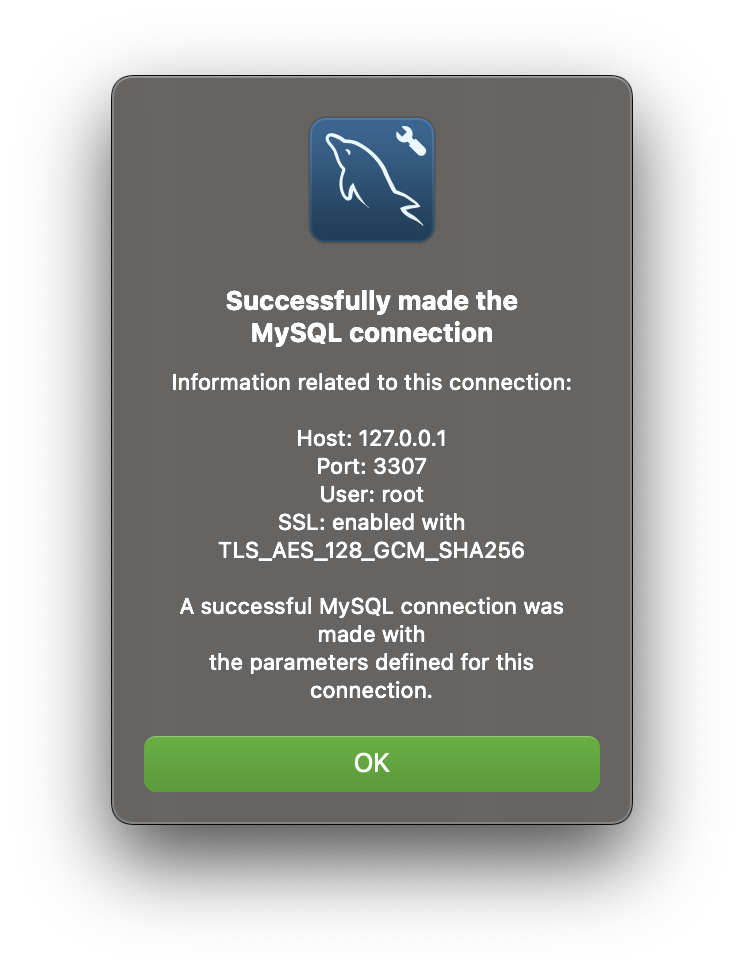
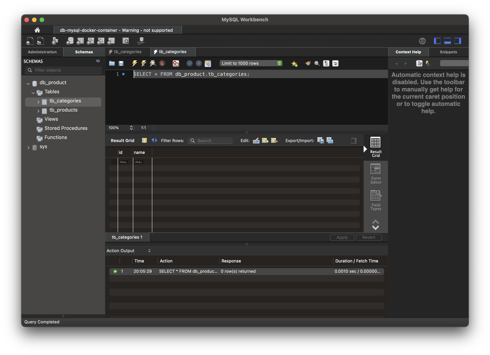
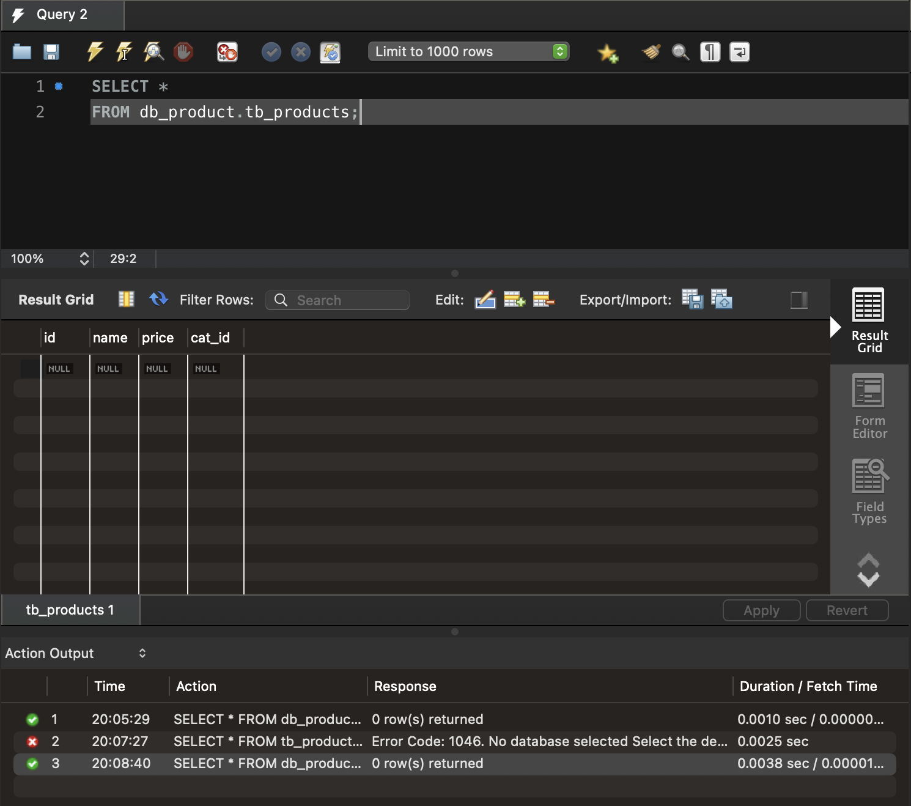
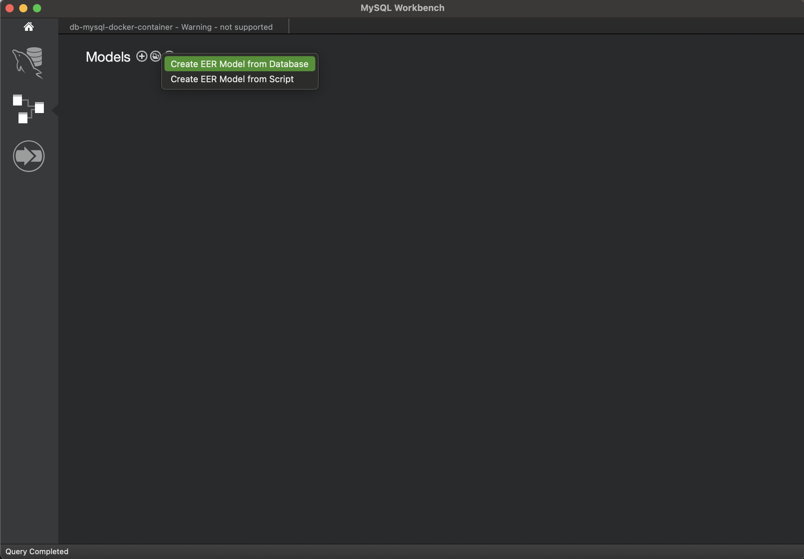
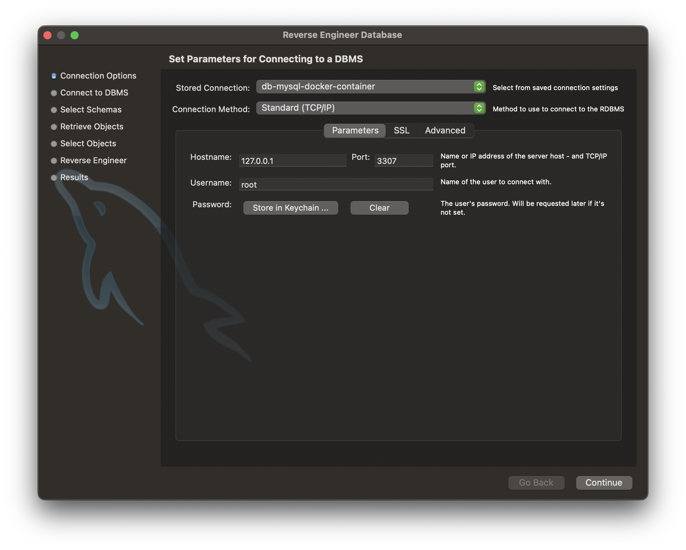
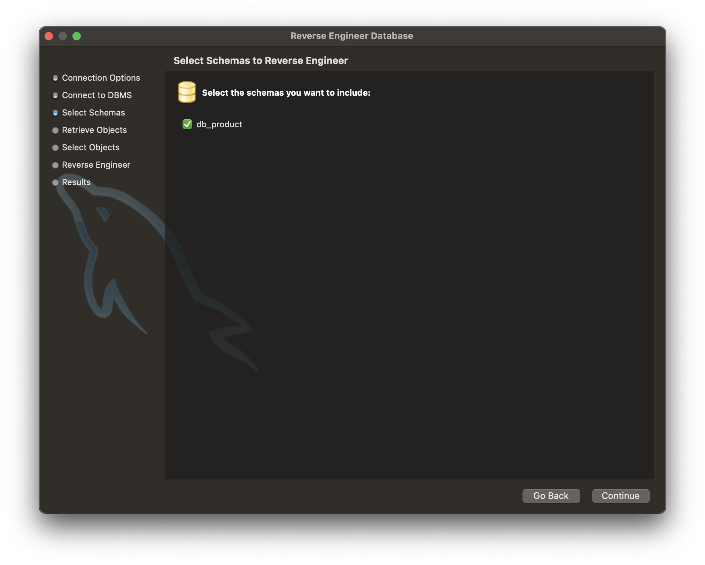
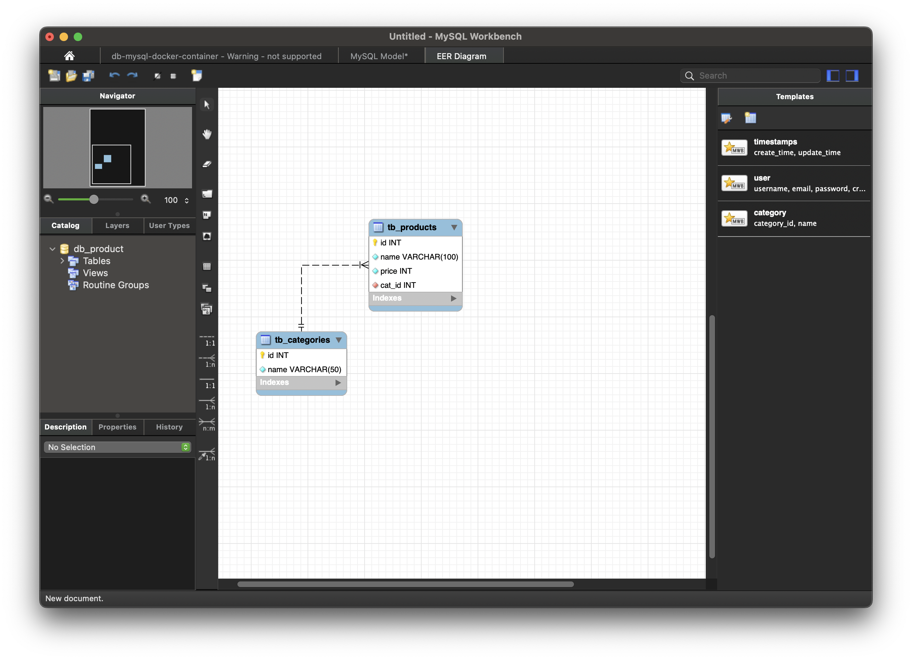

# Lab03 - Create and Access database on MySQL Docker Container

https://dev.mysql.com/doc/refman/8.4/en/creating-database.html
https://phoenixnap.com/kb/how-to-create-a-table-in-mysql

## Step 01:
Install Client GUI tool to access Database

* MySQL Workbench: 
* Azure Data Studio: 

Install extension:

* MySQL
* SQL Database Project

## Step 02:
Connect to Database with Terminal 

### Step 2.1:

Start MySQL Docker Container

``` shell
docker container start db-mysql
```

Check status of MySQL Docker Container

``` shell
docker ps
```

### Step 2.2:

Access to MySQL Docker Conatiner

``` shell
docker exec -it db-mysql bash
```

### Step 2.3:

Connect to Database on MySQL Docker Container

``` shell
mysql -u db_user -p
```

## Step 3:
Create Database with command

```sql
CREATE {DATABASE | SCHEMA} [IF NOT EXISTS] db_name
    [create_option] ...

create_option: [DEFAULT] {
    CHARACTER SET [=] charset_name
  | COLLATE [=] collation_name
  | ENCRYPTION [=] {'Y' | 'N'}
}
```

andd now, we create database **db-product**

```sql
CREATE DATABASE IF NOT EXISTS db_product
CHARACTER SET 'utf16'
COLLATE 'utf16_unicode_ci';
```

```sql
SELECT DEFAULT_CHARACTER_SET_NAME, DEFAULT_COLLATION_NAME FROM INFORMATION_SCHEMA SCHEMATA WHERE SCHEMA_NAME = 'db_product';
```

????

Use database
```sql
use db_product;
```

Show current database:
```sql
SELECT DATABASE();
```

Drop database:
```sql
DROP DATABASE db_product;
```

Show all database:
```sql
SHOW DATABASES;
```

## Step 04:
Create new table with foreign key

* choose default storage engine for current section.

```sql
SET default_storage_engine = InnoDB;
```

* choose database to create categories table

* create categories table
```sql
CREATE TABLE IF NOT EXISTS tb_categories(
    id INT AUTO_INCREMENT PRIMARY KEY,
    name VARCHAR(50) NOT NULL
) CHARACTER SET utf16 COLLATE utf16_unicode_ci ENGINE=InnoDB;
```

or 

```sql
CREATE TABLE IF NOT EXISTS tb_categories(
    id INT AUTO_INCREMENT,
    name VARCHAR(50) NOT NULL,
    PRIMARY KEY (id)
) CHARACTER SET utf16 COLLATE utf16_unicode_ci ENGINE=InnoDB;
```

* Create **tb_product** table have foreign key to reference to id of tb_catgories


```sql
CREATE TABLE IF NOT EXISTS tb_products(
  id INT AUTO_INCREMENT NOT NULL,
  name VARCHAR(100) NOT NULL,
  price INT NOT NULL,
  cat_id INT NOT NULL, 
  PRIMARY KEY (id),
  FOREIGN KEY (cat_id) 
    REFERENCES tb_categories(id) 
    ON UPDATE CASCADE 
    ON DELETE RESTRICT
) CHARACTER SET utf16 COLLATE utf16_unicode_ci ENGINE=InnoDB;
```

* Show table
```sql
SHOW TABLES;
```

* Using __DESCRIBE__ command to show table structure

```sql
DESCRIBE table_name;
```

## Step 05
Using GUI Client tool to access to MySQL Docker Container

### 5.1 MySQL Workbench

Download MYSQL Workbench: [Download](https://dev.mysql.com/downloads/workbench/)



* Create Connect to Database with MySQL Workbench



* Click to "Test Connection"



Click to Ok button to save the connection

* Connect to database (Database Schema db-product)

Click connection which is created above step to connect to the database



* Using MySQL Workbench to access database (database schema db_product)

Create Query to access to the database.



* Create EER model (Database Diagram) with MySQL Workbench

Create EER model from Database



*Using connection which is create to the database



Click "Continue" button to move to next step

*Choose DB to create EER model



CLick "Continue" button to complete the wizard.

*** The EER is the same as the picture below. ***

