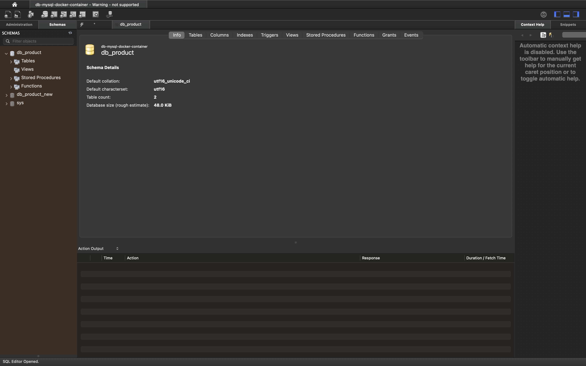
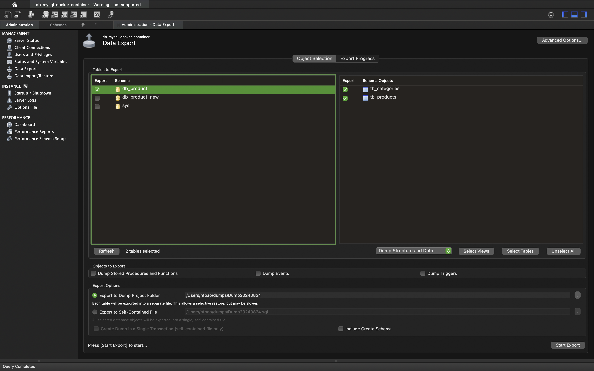
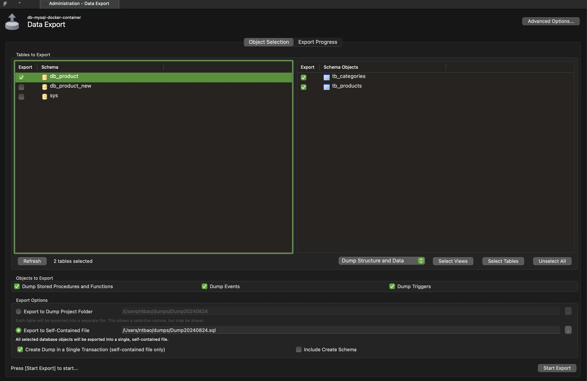
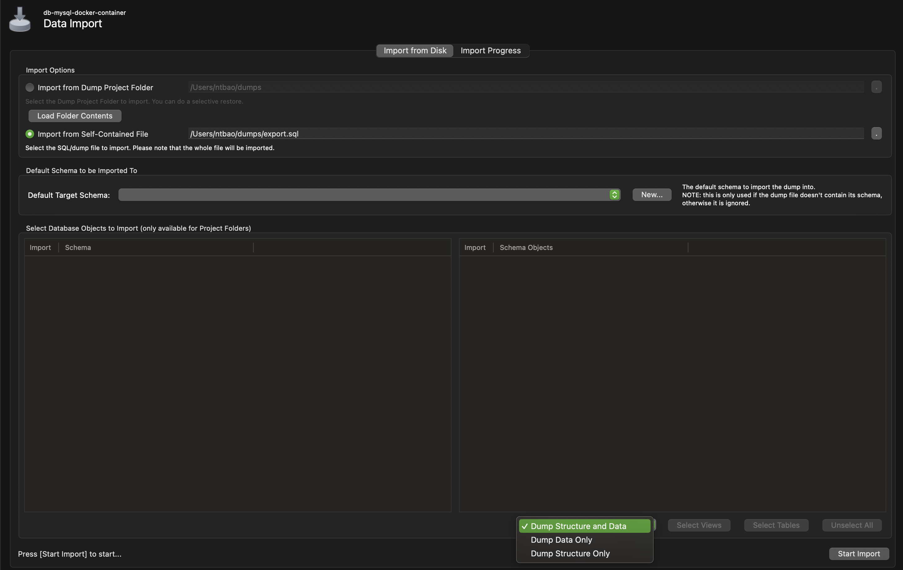

# Lab 05 - Export and Import Data

## 1 - Using Terminal

### 1.1 - Export Database

* Connect to MySQL Docker Container

```shell
docker exec -it db-mysql bash
```

* Navigate to Docker's directory "/var/lib/mysql" because docker volume is previously mapped here.

```shell
cd /var/lib/mysql
```

* Dump database to Script SQL File with name db_product_script.sql

```shell
mysqldump -u root -p db_product > db_product_script.sql
```

* Copy exported Script file "db_product_script.sql" from Docker's volume or Docker's container "db-mysql-new-data" to host (PC) 

```shell
docker cp db-mysql:/var/lib/mysql/db_product_script.sql ./scripts/db_product_script_01.sql
```

### 1.2 - Import Database

* Duplicate the exported script file db_product_script.sql to db_product_new.sql
* Create new database in MYSQL

```sql
CREATE DATABASE IF NOT EXISTS db_product
CHARACTER SET 'utf16'
COLLATE 'utf16_unicode_ci';
```

* Copy file "db_product_new.sql" to Docker's Volume (Docker Container) ["/var/lib/mysql"]

```shell
docker cp ./scripts/db_product_new.sql db-mysql:/var/lib/mysql/
```

* In MySQL Docker Container, Execute "db_product_new.sql" with import data to database "db_product_new"

```shell
mysql -u root -p db_product_new < ./var/lib/mysql/db_product_new.sql
```

* Connect to database to chheck data after import

```shell
mysql -u root -p
```

Input root pass (admin123)

* Show all databases

```sql
SHOW DATABASES;
```

* Set working curret database "db_product_new"

```sql
USE db_product_new;
```

* Show all tables in "db_product_new"

```sql
SHOW TABLES;
```

* Execute query to check data 

```sql
SELECT p.id, p.name, p.price, c.name
FROM tb_products p LEFT JOIN tb_categories c ON p.cat_id = c.id;
```

## 2 - Using GUI Tool - MySQL Workbench

#### 2.1 - Export Database with MySQL Workbench

* Connect to MySQL Docker Container with MySQL Workbench



* In MySQL Workbench, on the "Administator" Panel, Select "Data Export" and tick Databases "db_product"



* In right panel of "Administration" Data Export", Tick database "db_product" and specification tables/all database, dump "Store Procedure/Trigger/Function" and "Data". After that, choose host location to store sql script files which will be exported.



> Edit SQL Script file because the script contain special code which is used to define DELIMITER to create function.
> * Change name of database
> ```
> CREATE DATABASE  IF NOT EXISTS `db_product_workbench` /*!40100 DEFAULT CHARACTER SET utf16 COLLATE utf16_unicode_ci */ /*!80016 DEFAULT ENCRYPTION='N' */; USE `db_product_workbench`;
> ```
> * add the SQL command before the line to create "Delimiter;;"
> ``` sql
>SET GLOBAL log_bin_trust_function_creators = 1;
> ```


#### 2.2 - Import Database with MySQL Workbench

* In MySQL Workbench, on the "Administrator" panel, choose "Data Import/ Restore"

* Specific database to import



> Azure Data Studio only Export and Import Database for MS SQL Server


