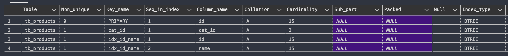
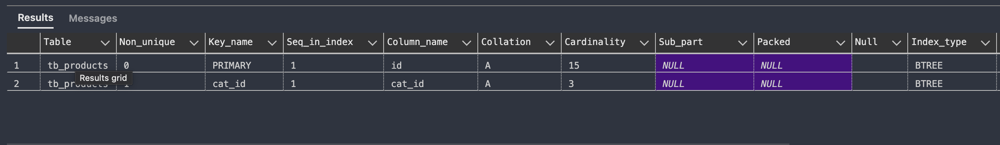

# Index data in MySQL

Using database ***db_product*** for labs

## 1 - Create Index syntax

* Syntax

```sql
CREATE INDEX index_name
ON table_name (column1, column2, ...);
```

* Example: Create index for column ***Id*** and ***name*** of table ***tb_products***

```sql
CREATE INDEX idx_id_name ON tb_products(id, name);
```

## 2 - Show INDEX of a table

* Show list of INDEXs on table ***tb_products***

```sql
SHOW INDEX FROM tb_products;
```



## 3 - Drop INDEX of a table

* Drop INDEX ***idx_id_name*** of the table ***tb_products***

```sql
DROP INDEX idx_id_name ON tb_products;
```

* After that, show the list of indexes 

```sql
SHOW INDEX FROM tb_products;
```

