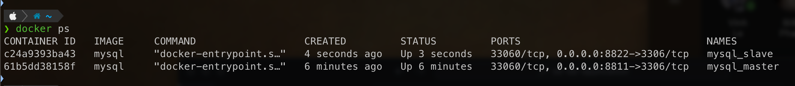

# Replicate set in Mysql

Using database ***db_product***

Reference:
* Setup with Linux Server - [https://phoenixnap.com/kb/mysql-master-slave-replication](https://phoenixnap.com/kb/mysql-master-slave-replication)

* Setup with MySQL Docker Container - [https://www.linkedin.com/pulse/mysql-master-slave-replication-setup-docker-trong-luong-van-5wbxc/](https://www.linkedin.com/pulse/mysql-master-slave-replication-setup-docker-trong-luong-van-5wbxc/)

## 1 - Method 01: Setup replica set for MySQL Docker Container

* Follow reference - [https://www.linkedin.com/pulse/mysql-master-slave-replication-setup-docker-trong-luong-van-5wbxc/](https://www.linkedin.com/pulse/mysql-master-slave-replication-setup-docker-trong-luong-van-5wbxc/)

### 1.1 - Step 01 - Prerequisites

* Create Docker network with name ***dnw_mysql_replica_set***

```shell
docker network create dnw_mysql_replica_set
```

* Check docker network 

```shell
docker network ls
```

* Run MySQL MASTER Docker Container

Check for docker's image ***my-sql***

```shell
docker image ls
```

Create and Run Docker Container for MySQL MASTER with information:
> Docker container name: ***mysql_master*** \
> Docker container port: ***8811:3306*** \
> Docker MySQL Root user password: ***admin123***

```shell
docker run -d \
    --name mysql_master \
    --network dnw_mysql_replica_set \
    -p 8811:3306
    -e MYSQL_ROOT_PASSWORD='admin123'
    mysql
```

* Run MySQL SLAVE Docker Container

Create and Run Docker Container for MySQL SLAVE with information:
> Docker container name: ***mysql_slave*** \
> Docker container port: ***8822:3306*** \
> Docker MySQL Root user password: ***admin123***

```shell
docker run -d \
    --name mysql_slave \
    --network dnw_mysql_replica_set \
    -p 8822:3306
    -e MYSQL_ROOT_PASSWORD='admin123'
    mysql
```

* Check for running Docker Containers



