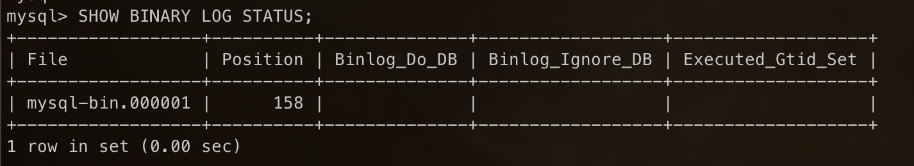
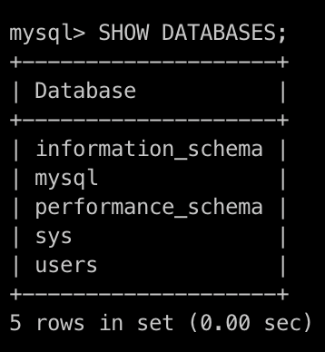

# Replicate set in Mysql

Using database ***db_product***

Reference:
* Setup with Linux Server - [https://phoenixnap.com/kb/mysql-master-slave-replication](https://phoenixnap.com/kb/mysql-master-slave-replication)

* Setup with MySQL Docker Container - [https://www.linkedin.com/pulse/mysql-master-slave-replication-setup-docker-trong-luong-van-5wbxc/](https://www.linkedin.com/pulse/mysql-master-slave-replication-setup-docker-trong-luong-van-5wbxc/)

## 1 - Method 01: Setup replica set for MySQL Docker Container

* Follow reference - [https://www.linkedin.com/pulse/mysql-master-slave-replication-setup-docker-trong-luong-van-5wbxc/](https://www.linkedin.com/pulse/mysql-master-slave-replication-setup-docker-trong-luong-van-5wbxc/)

### 1.1 - Step 01 - Prerequisites

* Create Docker network with name ***dnw_mysql_replica_set***

```shell
docker network create dnw_mysql_replica_set
```

* Check docker network 

```shell
docker network ls
```

* Run MySQL MASTER Docker Container

Check for docker's image ***my-sql***

```shell
docker image ls
```

Create and Run Docker Container for MySQL MASTER with information:
> Docker container name: ***mysql_master*** \
> Docker container port: ***8811:3306*** \
> Docker MySQL Root user password: ***admin123***

```shell
docker run -d \
    --name mysql_master \
    --network dnw_mysql_replica_set \
    -p 8811:3306
    -e MYSQL_ROOT_PASSWORD='admin123'
    mysql
```

* Run MySQL SLAVE Docker Container

Create and Run Docker Container for MySQL SLAVE with information:
> Docker container name: ***mysql_slave*** \
> Docker container port: ***8822:3306*** \
> Docker MySQL Root user password: ***admin123***

```shell
docker run -d \
    --name mysql_slave \
    --network dnw_mysql_replica_set \
    -p 8822:3306
    -e MYSQL_ROOT_PASSWORD='admin123'
    mysql
```

* Check for running Docker Containers


### 1.2 - Step 02 - Config Master-Slave Replication

1: Accessing Container Configuration files

*copy files my.cnf from master and slave mysql docker container to real folder ./mysql*

```shell
docker cp mysql_master:/etc/my.cnf ./lab10/mysql/master
docker cp mysql_slave:/etc/my.cnf ./lab10/mysql/slave
```

* Edit configuration files

Update configuration to ***./lab10/mysql/master***

```lua
log_bin=mysql-bin
server-id=1
```

Update configuration to ***./lab10/mysql/slave***

```lua
log_bin=mysql-bin
server-id=2
```

* Copy configuration files to mysql docker container

```shell
docker cp ./lab10/mysql/master mysql_master:/etc/my.cnf
docker cp ./lab10/mysql/slave mysql_slave:/etc/my.cnf
```

* Restart 2 MySQL Docker Containers

```shell
docker restart mysql_master
docker restart mysql_slave
```

* Get information about the MASTER replication setup 

> Login with ROOT user to MySQL Docker Container 

```shell
docker exec -it mysql_master bash
mysql -u root -p
```
* Enter root_password = admin123

> Run SQL Command to get Master Status

```sql
~~ Using MySQL 8.0 and before 
SHOW MASTER STATUS;

~~ Using MySQL 9.0 and after
SHOW BINARY LOG STATUS;
```



> file: mysql-bin.000001 \
> position: 158

Inspect information of Master Container

```shell
docker inspect mysql_master
```

Then get the IP Address of the Master Container

```json
"IPAddress": "172.19.0.2"
```

* Configuring Slave Replication

Access Slave Container with MYSQL CLI

```shell
docker exec -it mysql_slave bash
mysql -u root -p
```
* Enter root_password = admin123

Execute command to configure ***SLAVE Replication*** setting

```sql
~~ Using for MySQL 8.0 and after

CHANGE MASTER TO
    MASTER_HOST='172.18.0.2',
    MASTER_PORT=3306,
    MASTER_USER='root',
    MASTER_PASSWORD='password',
    MASTER_LOG_FILE='mysql-bin.000001',
    MASTER_LOG_POS=157,
    MASTER_CONNECT_RETRY=60,
    GET_MASTER_PUBLIC_KEY=1;

~~ Using for MySQL 9.0 and after

CHANGE REPLICATION SOURCE TO
    SOURCE_HOST='172.19.0.2',
    SOURCE_PORT=3306,
    SOURCE_USER='root',
    SOURCE_PASSWORD='admin123',
    SOURCE_LOG_FILE='mysql-bin.000001',
    SOURCE_LOG_POS=158,
    SOURCE_CONNECT_RETRY=60,
    GET_SOURCE_PUBLIC_KEY=1;
```

Run the replica

```sql
~~ Using for MySQL 8.0 and after

start slave;

~~ Using for MySQL 9.0 and after

START REPLICA;
```

After configuring, verify status by MySQL CLI

```sql
~~ Using for MySQL 8.0 and after

show slave status\G; 

~~ Using for MySQL 9.0 and after

show replica status\G; 
```

We check and confirm:
> Version MySQL 8.0 and before
***Slave_IO_Running: Yes*** and ***Slave_SQL_Running: Yes***

> version MySQL 9.0 and after
***Replica_IO_Running: Yes*** and ***Replica_SQL_Running: Yes***

* Verifying Replication Setup

Create database ***user*** on ***Master Replication***

```sql
--- Create users database
CREATE DATABASE users default charset utf8mb4;

--- Show all databases
SHOW DATABASES;
```


After that, access to Slave Database and Check all databases

```sql
SHOW DATABASES;
```

If we see ***user*** database exist in both Master and Slave, we're done


